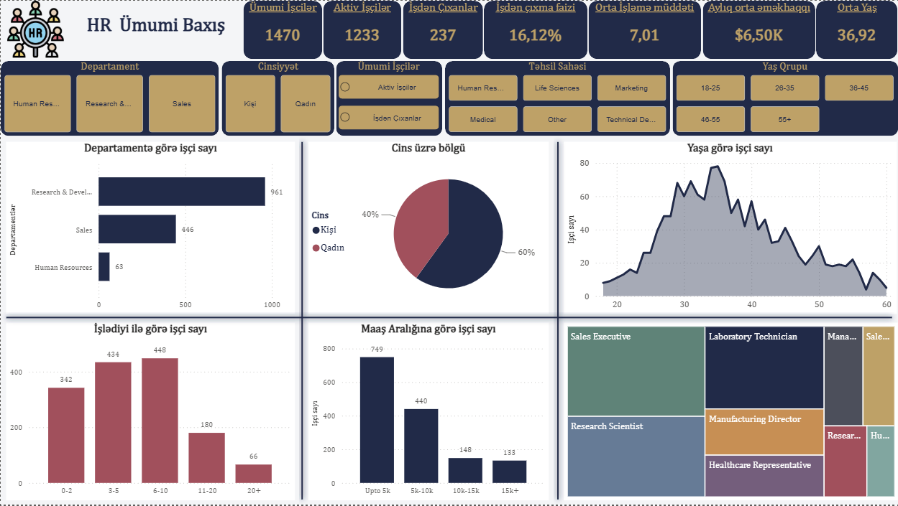
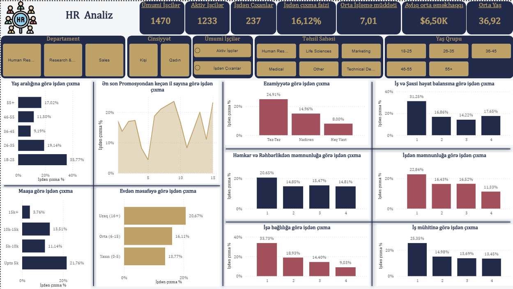
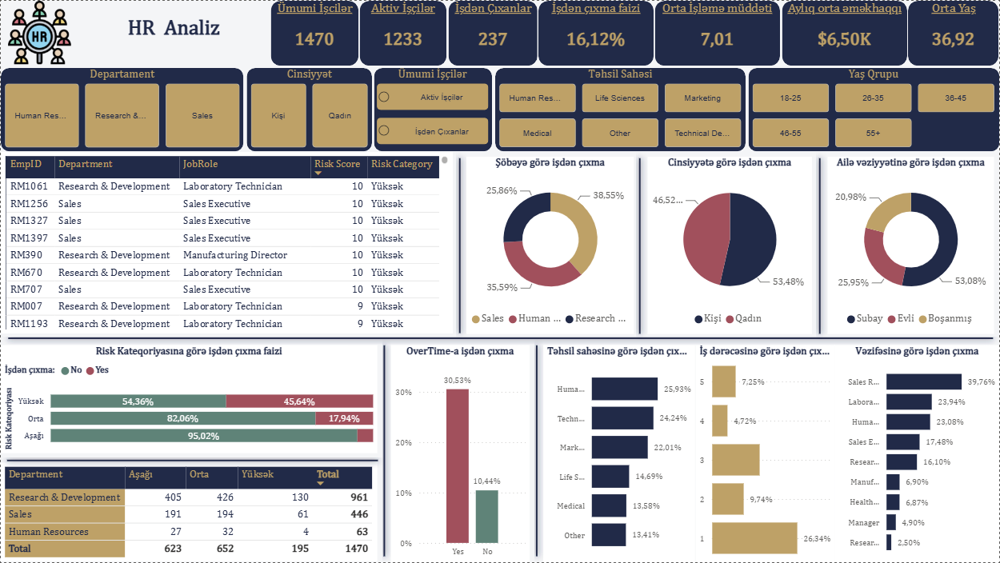

# 📊 HR Analytics Dashboard (Power BI)

İşçilərin ümumi statistikası, işdən çıxma (attrition) təhlili və risk analizini əks etdirən Power BI dashboard layihəsi. Dashboard Azərbaycan dilində hazırlanıb və HR şöbəsi üçün qərar dəstək aləti kimi istifadə oluna bilər.

## 🖼️ Dashboard Səhifələri

### 1️⃣ HR Ümumi Baxış
Departament, cins, yaş və maaş üzrə işçilərin ümumi bölgüsü.



### 2️⃣ İşdən Çıxma Təhlili (Attrition Analysis)
Yaş, maaş, iş-şəxsi həyat balansı, ezamiyyət və məmnunluq amillərinə görə işdən çıxma faizi.



### 3️⃣ İşçi Analizi və Risk Skoru
Yüksək risk qrupundakı işçilərin siyahısı, departament üzrə risk kateqoriyaları və overtime təsiri.



## 🔑 Əsas Göstəricilər (KPI-lar)

| Göstərici | Dəyər |
|---|---|
| Ümumi işçi sayı | 1,470 |
| Aktiv işçilər | 1,233 |
| İşdən çıxanlar | 237 |
| İşdən çıxma faizi | 16.12% |
| Orta işləmə müddəti | 7.01 il |
| Aylıq orta əməkhaqqı | $6.50K |
| Orta yaş | 36.92 |

## 🛠️ İstifadə olunan texnologiyalar

- **Power BI Desktop** — dashboard-ın hazırlanması
- **Power Query** — məlumatların təmizlənməsi və çevrilməsi
- **DAX** — hesablanmış sütunlar və ölçülər (risk skoru, faizlər və s.)
- **CSV** — mənbə məlumat dəsti (Kaggle IBM HR Analytics dataseti əsasında)

## 📁 Repo strukturu

```
HR-Analytics-Dashboard/
│
├── data/
│   └── HR_Analytics.csv          # Mənbə məlumat faylı
│
├── pbix/
│   └── HR_Analytics_Dashboard.pbix   # Power BI layihə faylı
│
├── images/
│   ├── 01_hr_overview.png
│   ├── 02_attrition_analysis.png
│   └── 03_employee_analysis.png
│
└── README.md
```

## 🚀 Necə açmaq olar?

1. [Power BI Desktop](https://www.microsoft.com/power-platform/products/power-bi/desktop) yükləyin (pulsuz).
2. `pbix/HR_Analytics_Dashboard.pbix` faylını açın.
3. Lazım gəlsə, `data/HR_Analytics.csv` yolunu Power Query-də yeniləyin (Transform Data → Data Source Settings).

## 📈 Əsas nəticələr (Insights)

- İşdən çıxma faizi ən çox **18-25 yaş qrupunda** (35.77%) müşahidə olunur.
- **Overtime** işləyən işçilərdə işdən çıxma faizi (30.53%) overtime işləməyənlərə (10.44%) nisbətən əhəmiyyətli dərəcədə yüksəkdir.
- **Risk skoru yüksək** olan işçilərin 45.64%-i artıq işdən çıxıb, bu da erkən müdaxilə üçün əsas siqnaldır.
- **Research & Development** departamenti həm ən çox işçiyə, həm də mütləq ədədlə ən çox yüksək-risk işçiyə malikdir.

## 👤 Müəllif

Bu dashboard [adınızı əlavə edin] tərəfindən Kaggle-in IBM HR Analytics Employee Attrition & Performance datasetindən istifadə edilərək hazırlanmışdır.

## 📄 Lisenziya

Bu layihə tədris/portfolio məqsədi daşıyır. Məlumat dəsti [Kaggle](https://www.kaggle.com/datasets/pavansubhasht/ibm-hr-analytics-attrition-dataset) üzərindən açıq mənbədir.
